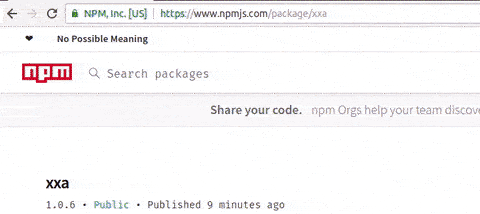

# xxa
Dynamic Scaffolder.
Copies source folder to destination folder through template engine.

#### Install:
- `npm i -g xxa`



### Conventions
- files: `{{{option~pipe1~pipe2~pipeN}}}.txt`
- content: `{{{option | pipe1 | pipe2 | pipeN}}}`

```
  $ xxa <source-dir> <destination-dir> [options]
  
  Example:
    $ xxa article-template article --article="Hello Article"
    
    <source-dir>
      article-template/{{{article~camel}}}.html
   
    <destination-dir>
      article/helloArticle.html

    > source content
        article-template/{{{article~camel}}}.html
          {{{article | upper}}}

    > destination content
        article/helloArticle.html
          HELLO ARTICLE
```

### Pipes
```javascript
const _ = require('lodash');
const pluralize = require('pluralize');

module.exports = {
    camel: (input) => _.camelCase(input),
    Camel: (input) => _.upperFirst(_.camelCase(input)),

    kebab: (input) => _.kebabCase(input),
    Kebab: (input) => _.upperFirst(_.kebabCase(input)),

    snake: (input) => _.snakeCase(input),
    Snake: (input) => _.upperFirst(_.snakeCase(input)),

    lower: (input) => _.toLower(input),
    upper: (input) => _.toUpper(input),
    up: (input) => _.toUpper(input),

    Lower: (input) => _.upperFirst(_.toLower(input)),
    Upper: (input) => _.toUpper(input),

    toUpper: (input) => _.toUpper(input),
    toLower: (input) => _.toLower(input),

    camelCase: (input) => _.camelCase(input),
    kebabCase: (input) => _.kebabCase(input),
    snakeCase: (input) => _.snakeCase(input),
    startCase: (input) => _.startCase(input),

    lowerCase: (input) => _.lowerCase(input),
    upperCase: (input) => _.upperCase(input),

    lowerFirst: (input) => _.lowerFirst(input),
    upperFirst: (input) => _.upperFirst(input),

    capitalize: (input) => _.capitalize(input),
    trim: (input) => _.trim(input),

    trimStart: (input) => _.trimStart(input),
    trimEnd: (input) => _.trimEnd(input),

    plural: (input) => pluralize.plural(input),
    Plural: (input) => _.upperFirst(pluralize.plural(input)),

    singular: (input) => pluralize.singular(input),
    Singular: (input) => _.upperFirst(pluralize.singular(input)),

    toArray: (text) => _.snakeCase(text).split('_'),
    toString: (array) => _.isArray(array) ? array.join('_') : '' + array,

    first: (array) => _.first(array),
    last: (array) => _.last(array),

    slice: (input, start, end) => _.slice(input, start, end),
    join: (input, separator) => _.join(input, separator || ''),
};
```

### Options
- `--xxa-no-dot`
- `--xxa-version` prints version
